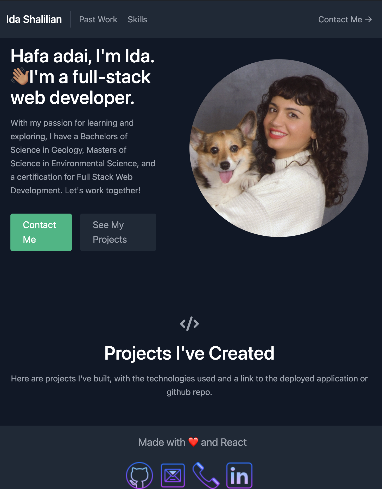

# React Portfolio

This is [my portfolio](https://corgimaman.github.io/reacc-portfolio/) built with React!

I followed a [tutorial](https://www.freecodecamp.org/news/build-portfolio-website-react/) to build this portfolio. It was fun to create and it looks awesome. It uses [Tailwind CSS](https://tailwindcss.com/).